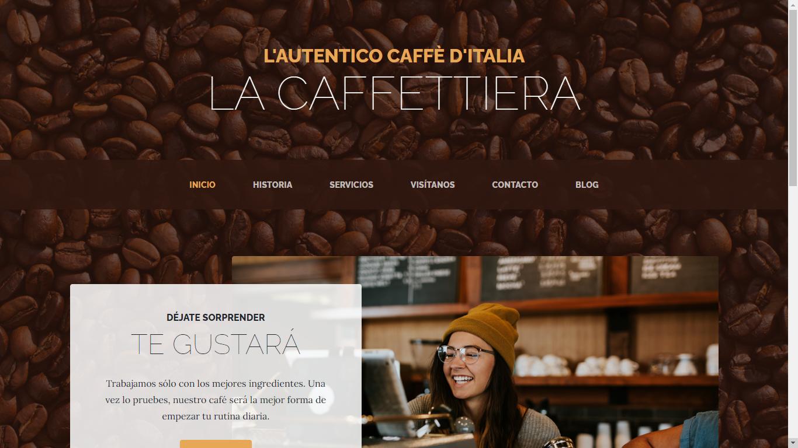

# Web Empresarial - La Caffettiera



Este repositorio almacena una aplicación web para la gestión de una cafetería. La cafetería proporciona servicios en un menú y posee un blog donde se podrán realizar publicaciones como ofertas del mes y permite registrar las redes sociales de la empresa. Todo lo antes mencionado será configurado mediante el panel administrativo cuyo acceso se encuentra en la ruta `/admin` y adicionalmente la app permite que las personas puedan contactar al dueño de la empresa a través de un corre que será enviado desde un formulario.

Cada servicio está compuesto por:
* Titulo.
* Subtitulo.
* Contenido.
* Imagen

El blog está compuesto por:
* Post
    1. Titulo.
    2. Contenido.
    3. Imagen.
    4. Autor.
    5. Ccategorias.
* Categoria
    1. Nombre de la categoria.

## Detalles de la implementacion

Para la construcción de esta App se contó con un desarrollo previo del Front-End implementado en las tecnologías `HTML5`, `CSS3`, `JavaScript` y el framework de `Bootstrap` al cual se le aplico el desarrollo del Back-End implementado por mi persona con el framework `Django` de `Python` y una base de datos en `PostgreSQL`.

## Instalacion

* Requerimientos previos
    1. Instalar el intérprete  de Python.
    2. Instalar el manejador de paquetes PIP.
    3. Instalar y configurar PostgreSQL.
* Requisitos para desplegar el proyecto de forma local
    1. Clonar el repositorio.
    2. Crear un entorno virtual en la carpeta del proyecto clonado.
    3. Activar el entorno virtual e instalar las dependencias del proyecto que se encuentran en el archivo `requirements.txt`.
    4. Renombrar el archivo `.env.example` por `.env`.
    5. Generar un SECRET_KEY.
    6. Agregue su usuario y contraseña de postgres en *USER_DATABASE* y *PASSWORD_DATABASE* del archivo `.env`.
    7. Ejecutar migraciones de la base de datos.
    8. Crear un super usuario en `Django`.
    9. Ejecutar el servidor.

## Comandos
### Crear entorno virtual
* Windows
```bash
py -m venv venv
```

* Linux
```bash
virtualenv venv -p python3
```

### Activar entorno virtual
* Windows
```bash
source venv/Scripts/activate
```

* Linux
```bash
source venv/bin/activate
```

### Instalar dependencias del proyecto
* Windows
```bash
py -m pip install requirements.txt
```

* Linux
```bash
pip3 install requirements.txt
```

### Generar el SECRET_KEY
* Windows
```bash
py generate_key.py
```

* Linux
```bash
python3 generate_key.py
```

### Ejecutar migraciones a la Base de datos
* Windows
```bash
py manage.py makemigrations && py manage.py makemigrations core && py manage.py makemigrations services && py manage.py makemigrations social && py manage.py makemigrations blog && py manage.py makemigrations pages && py manage.py makemigrations contact && py manage.py migrate
```

* Linux
```bash
python3 manage.py makemigrations && python3 manage.py makemigrations core && python3 manage.py makemigrations services && python3 manage.py makemigrations social && python3 manage.py makemigrations blog && python3 manage.py makemigrations pages && python3 manage.py makemigrations contact && python3 manage.py migrate
```

### Crear super usuario
* Windows
```bash
py manage.py createsuperuser
```

* Linux
```bash
python3 manage.py createsuperuser
```

### Ejecutar el servidor
* Windows
```bash
py manage.py runserver
```

* Linux
```bash
python3 manage.py runserver
```